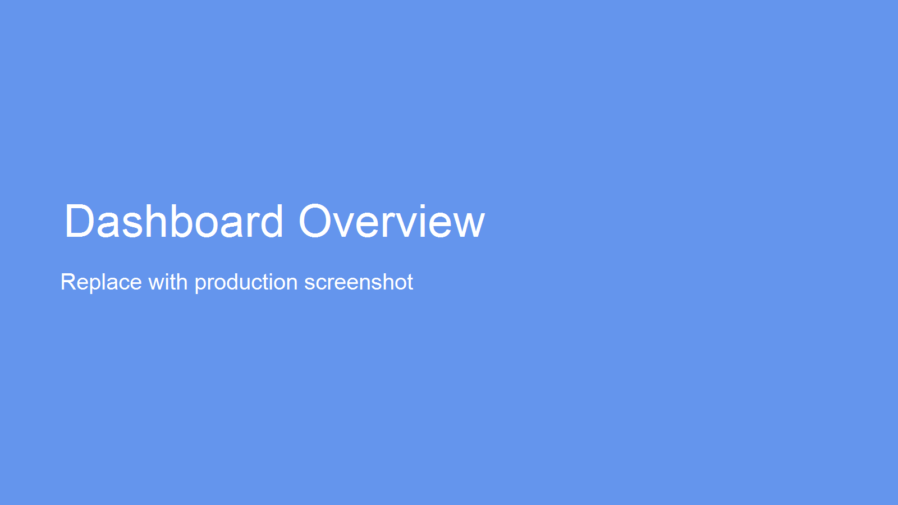
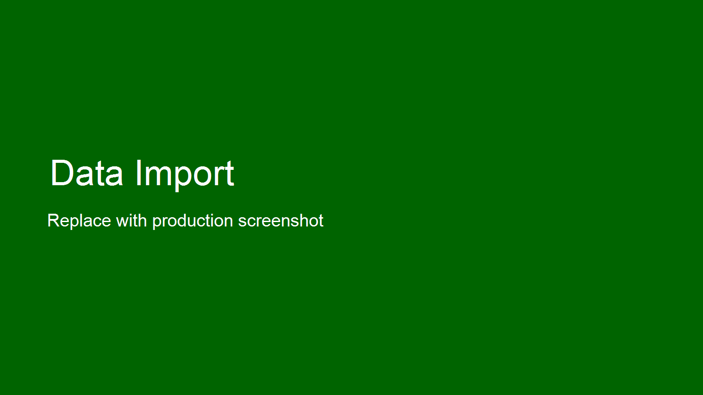
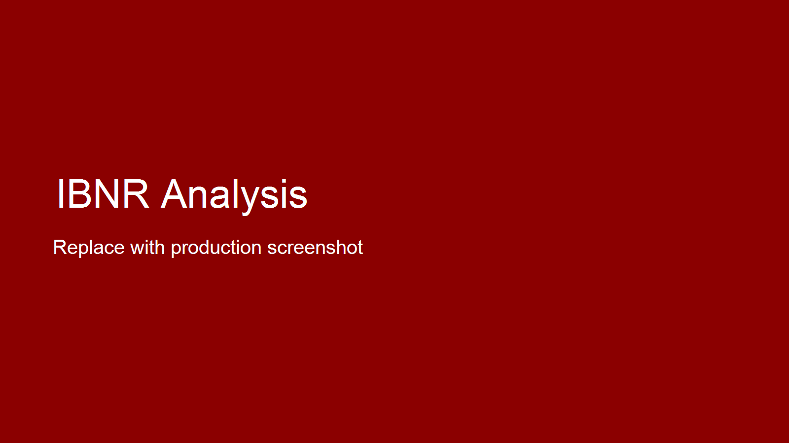
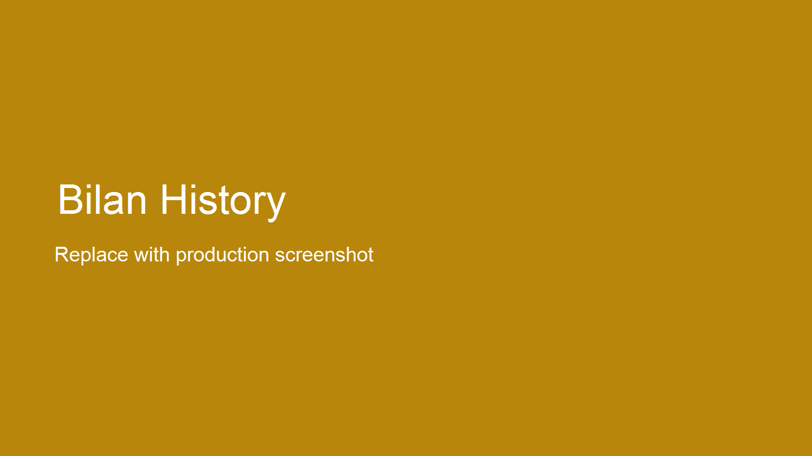
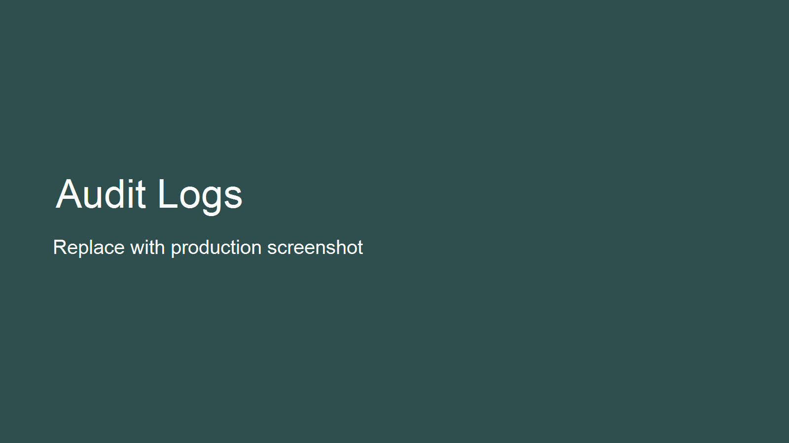
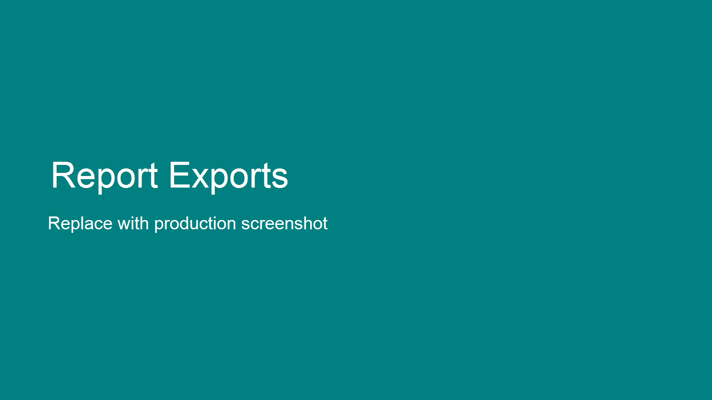

# L Algerienne Vie Insights

Actuarial provisioning platform for insurance operations, with a FastAPI backend and a React + Vite frontend.

This repository is ready to be pushed as a first full release.

## Scope

The platform centralizes import, run execution, validation, traceability, and reporting for:

- PPNA
- SAP
- PE
- PB
- IBNR
- Bilan history and printable snapshots

## Main capabilities

- Domain-based calculation runs with stored artifacts
- Authentication and role-based access (ADMIN, HR, VIEWER)
- Dashboard summary, completion, alerts, and timeline APIs
- Bilan generation, history, and snapshot archive
- Frontend pages per domain with charts and export actions
- Audit event visibility for operational traceability

## Functional domains

| Domain | Purpose |
| --- | --- |
| PPNA | Unearned premium provisioning |
| SAP | Claims reserve tracking |
| PE | Equalization reserve |
| PB | Profit participation reserve |
| IBNR | Incurred but not reported reserve |

## Product screenshots

Platform walkthrough captures are stored in [docs/captures](docs/captures).

Guide: [docs/captures/CAPTURES_GUIDE.md](docs/captures/CAPTURES_GUIDE.md)

<table>
	<tr>
		<td width="50%" align="center"><strong>Dashboard</strong><br/></td>
		<td width="50%" align="center"><strong>Import and run</strong><br/></td>
	</tr>
	<tr>
		<td width="50%" align="center"><strong>IBNR</strong><br/></td>
		<td width="50%" align="center"><strong>Bilan history</strong><br/></td>
	</tr>
	<tr>
		<td width="50%" align="center"><strong>Audit</strong><br/></td>
		<td width="50%" align="center"><strong>Exports</strong><br/></td>
	</tr>
</table>

## Tech stack

### Backend

- Python
- FastAPI
- Uvicorn
- SQLite
- openpyxl
- numpy

### Frontend

- React 19
- TanStack Router + Query
- Vite
- Recharts
- Radix UI

## Repository layout

Root is intentionally minimal to keep the repository professional.
Operational scripts, reports, and scenario files are grouped in dedicated folders.

```text
.
├─ backend/
│  ├─ data/
│  │  └─ scenarios/ibnr/ # experimental IBNR scenario workbooks
│  ├─ src/
│  │  ├─ backend/         # FastAPI app, services, auth, DB
│  │  ├─ preprocessing/   # workbook loaders and validators
│  │  ├─ provisions/      # PPNA/SAP/PE/PB/IBNR engines
│  │  ├─ orchestration/   # run pipelines and validations
│  │  └─ reporting/       # assumptions and reconciliation
│  ├─ tests/
│  ├─ storage/
│  └─ requirements.txt
├─ frontend/
│  ├─ src/
│  │  ├─ routes/
│  │  ├─ lib/
│  │  ├─ components/
│  │  └─ styles.css
│  ├─ package.json
│  └─ .env.example
├─ docs/
│  ├─ captures/
│  └─ reports/            # audit and alignment reports
├─ scripts/               # utility and e2e scripts
└─ README.md
```

## Prerequisites

- Windows PowerShell
- Python 3.10+
- Node.js 20+ and npm
- Git

## First-time local setup

### 1) Clone and open

```powershell
git clone <your-repo-url>
cd l-alg-rienne-vie-insights
```

### 2) Create and activate Python virtual environment

```powershell
python -m venv .venv
.\.venv\Scripts\Activate.ps1
python -m pip install --upgrade pip
pip install -r backend\requirements.txt
```

### 3) Install frontend dependencies

```powershell
cd frontend
npm install
Copy-Item .env.example .env -Force
cd ..
```

## Environment variables

### Backend (optional overrides)

| Variable | Default |
| --- | --- |
| OPEN_DATA_STORAGE_ROOT | storage |
| OPEN_DATA_DB_PATH | storage/backend.sqlite3 |
| OPEN_DATA_UPLOAD_MAX_BYTES | 15728640 |
| OPEN_DATA_ACCESS_TOKEN_TTL_MINUTES | 30 |
| OPEN_DATA_REFRESH_TOKEN_TTL_DAYS | 7 |
| OPEN_DATA_CORS_ORIGINS | localhost and 127.0.0.1 for common frontend ports |

### Frontend

| Variable | Default |
| --- | --- |
| VITE_API_BASE_URL | /api/v1 |
| VITE_BACKEND_PROXY_TARGET | http://127.0.0.1:8000 |

## Run the platform

Use two terminals from project root.

### Terminal A: backend API

```powershell
cd backend
..\.venv\Scripts\python.exe -m uvicorn src.backend.app:create_app --factory --host 127.0.0.1 --port 8000 --reload
```

### Terminal B: frontend

```powershell
cd frontend
npm run dev -- --host 127.0.0.1 --port 4173
```

## URLs

- Frontend: http://127.0.0.1:4173/
- Backend health: http://127.0.0.1:8000/api/v1/health
- Frontend proxied backend health: http://127.0.0.1:4173/api/v1/health

## Bootstrap first admin account

Use the login/bootstrap screen in the frontend, or call API directly:

```powershell
$payload = @{ username = "admin"; password = "Admin@123" } | ConvertTo-Json
Invoke-RestMethod -Uri "http://127.0.0.1:8000/api/v1/auth/bootstrap" -Method Post -ContentType "application/json" -Body $payload
```

## Suggested user workflow

1. Import workbook(s) by domain from the Import page.
2. Launch a run for each required domain.
3. Review Dashboard and domain pages.
4. Open Bilan, save snapshots, and print when needed.
5. Download artifacts from Exports.
6. Verify activity and traceability in Audit.

## Quality checks

### Backend tests

```powershell
cd backend
..\.venv\Scripts\python.exe -m pytest tests -q
```

### Frontend lint and build

```powershell
cd frontend
npm run lint
npm run build
```

## First push to GitHub (full initial push)

If this is your first push from this local project and you want to push everything as it is now:

### 1) Create an empty repository on your GitHub account

Example: https://github.com/<your-username>/<your-repo>

### 2) Set remote and push

```powershell
git remote set-url origin https://github.com/<your-username>/<your-repo>.git
git remote -v
git add -A
git commit -m "chore: initial full project push"
git push -u origin main
```

If commit reports nothing to commit, run only:

```powershell
git push -u origin main
```

## Add collaborators after push

On GitHub:

1. Open your repository.
2. Settings > Collaborators and teams.
3. Add people and choose permission (read, triage, write, maintain, admin).

## VS Code: Source Control icon not visible

1. Press Ctrl+Shift+G.
2. Enable Activity Bar from View > Appearance > Activity Bar.
3. Right-click the Activity Bar and ensure Source Control is checked.
4. Verify built-in Git extension is enabled, then reload VS Code.

## Notes

- Keep source-of-truth raw data unchanged if required for auditability.
- Do not commit secrets.
- Keep screenshots in [docs/captures](docs/captures) for stable README rendering.
